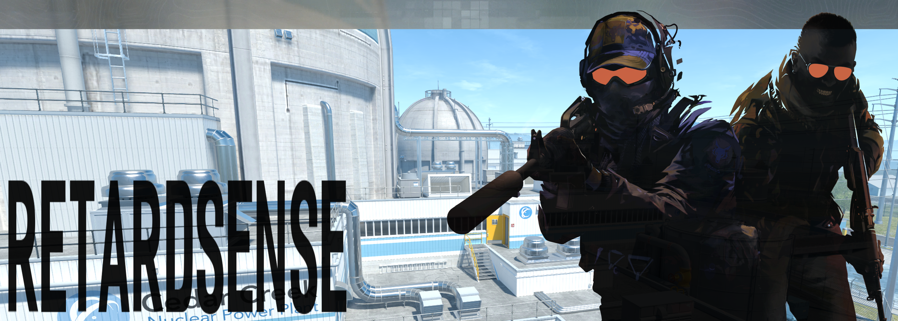

  
  
  
  
  
  
  
  
  
  
  
  

---

Original MIT code remains MIT, while My additions are under Apache 2.0 (or proprietary)

### RETARDsense is one of the best CS2 kernel-level read only external cheats, giving you best possible UD experience, at same time giving you ton of features, and auto updating offsets, all for free.

⚠️ NOTE THAT THIS CHEAT DOES NOT WORK WITH FACEIT AC ⚠️

### 📋 Features

Press END key to open/close menu.

Visual

  
- Box ESP
- Box Type
- Box Rounding
- Filled Box ESP
- Gradient Filled Box ESP
- Skeleton
- Snap Line
- Visual Color
- Eye Ray
- Health Bar
- Armor Bar
- Weapon
- Ammo
- Distance
- Name
- Scoped
- Blind
- AWP Crosshair
- Visual Preview
- etc

Radar Hack

  
- Point Size
- Proportion
- Range
- Alpha

Aimbot

  
- Start Bullet
- Aim Lock
- Draw Fov
- Visible Check
- Auto Only
- Flash Check
- Scope Check
- Humanization
- FOV
- Smooth
- Multi Hitboxes Selection

RCS

  
- Yaw
- Pitch
- Preview

Trigger Bot

  
- Scope Check
- Flash Check
- Stop Check
- Shot Delay
- Shot Duration

Misc

  
- Bomb Timer
- Bunny Hop
- Head Line
- Hit Sound
- Hit Markers
- Spectator list
- Watermark
- Anti Record

SkinChanger (WIP - not added yet, testing phrases)

  
- Knife Changer
- Glove Changer
- Agent Changer
- Weapon Changer
- Custom Models (USE AT YOUR OWN RISK)

---

### 🛠️How to use

At the beginning, download latest release. You need only 2 files `retardsense.exe` and `kernel.exe`.

> [!NOTE]  
> Kernel driver is close source for safety reasons, download it from release, it is completly safe.

Now you should run `kernel.exe` to map the driver. If You see `[+] success` all fine, then just run `retardsense.exe` and Everything should load up fine.

---

### ❌Mapper errors

> Error: `[-] \Device\Nal is already in use.`
>
> Solution: Use [NalFix](https://github.com/VollRagm/NalFix)

> Error: `[-] Your vulnerable driver list is enabled and have blocked the driver loading`
>
> Solution: Disable vulnerable driver list, [official solution](https://support.microsoft.com/en-au/topic/kb5020779-the-vulnerable-driver-blocklist-after-the-october-2022-preview-release-3fcbe13a-6013-4118-b584-fcfbc6a09936)

> Still getting: `[-] Failed to register and start service for the vulnerable driver`
>
> Solution: Turn off all Anti-Viruses and all Anti-Cheats client, usually it is caused due to FaceIT AC

---

### 🖼️Preview

---

big thanks to u/ByteCorum
